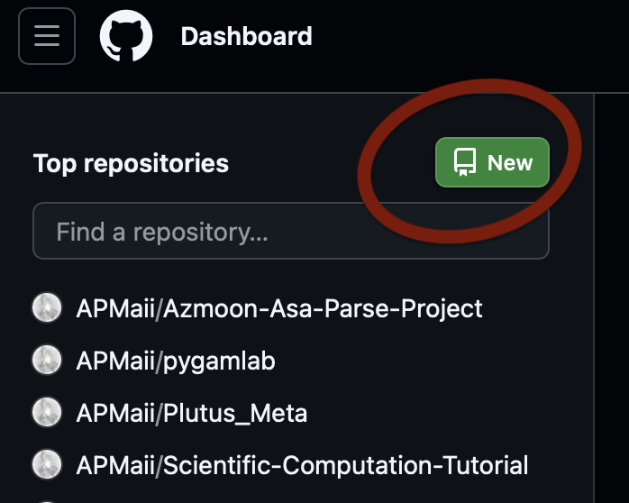
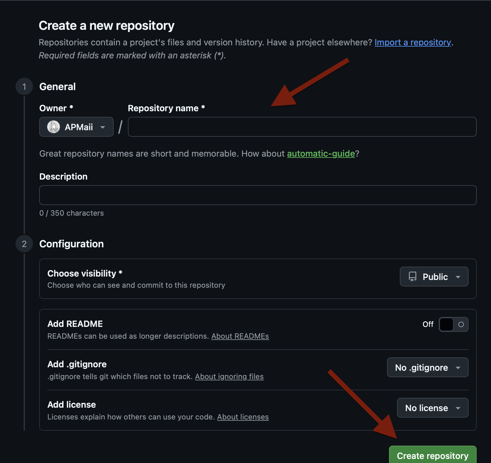
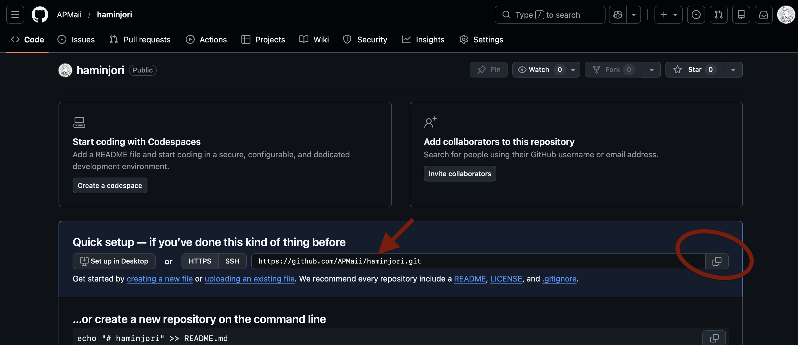
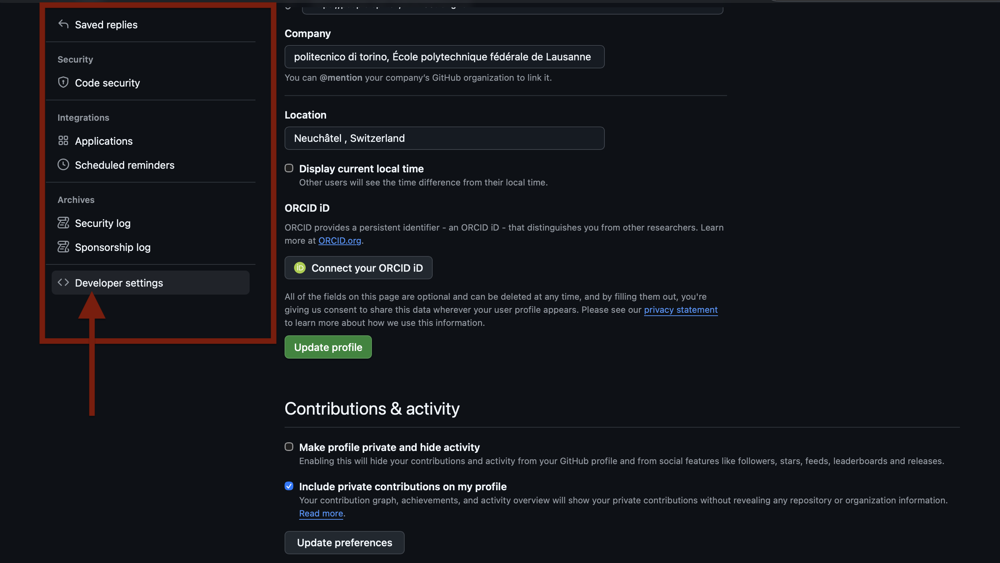
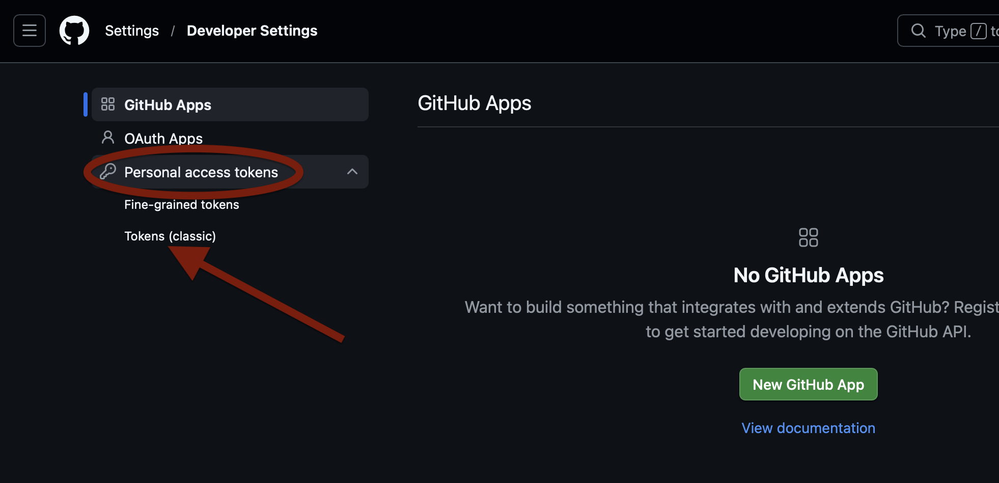
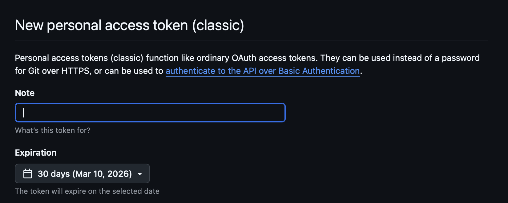
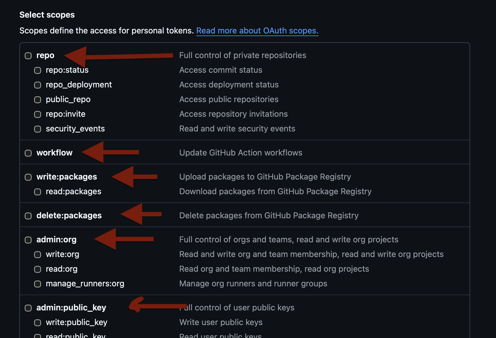
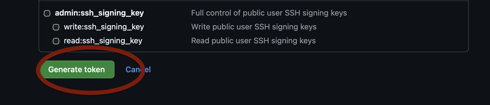

# Git Tutorial

**In The name of god**
Created on Fri Feb  6 16:18:52 2026
**author:** Ali Pilehvar Meibody

Aval ye negah be AI_CLI.py bendazid ke bebinid Bash chie , Cli chie chijoori mishe bedone GUI , harkari bekhaym ro ba CLI bokonim. emrooz mikhaym darmorede in se ta topic harf bznim
- 1-GIT
- 2-GITHUB
- 3-GITLAB
baham motefavet hast

------
------
------

# 1- GIT

wifi ghate ..... local (machine) computer laptob ro fght darid FOLDER DARI
- .py 
- .txt
- .md 
haroz dari taghir midi , bad az yemah migi ey kash man ychi dashtam k 1-aval migof ch zamani , kodom fiel skahyte shode , ch zamani tahghid dade shod , kojahash taghir dade shode ,ki taghiur dade (team) , ey kaah noti bod -taghiri , control konam folder , files
version control = control versioning
- 1-Nazm
- 2-Harmogeh khasi mitoni b har step bargardi
- 3-befahmi ki taghir dad, chi taghir dade ahode (bugg)
- 4-tozihi kash bood (description)

age tooye AI_CLI.py yadetoon biad ma yekserii CLI tool dashtim ke default boodan mesle vim (k mizasht edit bezanim ) hala yekseri darim bayad download konim --> yeki azina git hast
**TOOL (abzar) ---> git**
ejaze mide shoma control bversioning
control koni folder , fil hato

**hadaf**
folder sakhti, file sakhti
1-bege ki hasti va 
2-ch file ch zamani dari misazi k taghir midi
3-paye har taghirt tozih bnvis 
4-hameye ina jam bshan kenare ham
5- betoone inaro bargardi (step back)

Linus Trovalds --> ABAR ENSAN
3 rooz --> GIT Misaze


----

### MOSHKEL CHIE???
man koli file daram , directory (folder) va hey misazam , edit mizanam , hazf mikonam

-   File ha sakhte mishe
-   file ha edit mishe
-   file ha hazf mishe
-   mikham har kari k krdm sabt bshe --> sabteshon konm

ye nafarim , yechizi , y toooli , abzari --> nezarat kone
rooye kole laptab?? na , ye foldero neshon mikonm -> aghaye x ino moraghebesh bash (nexzarat kon)
**abzar --> git **
Linus Trovalds
-->systemam ---> bASH --> **AI_CLI.py**  cd pwd topuch ,.... | vel kon
abzari --> git --> dare laptabam? na

---

### Intsalling GIT

#### Windows
https://git-scm.com  (default option) Git bash(terminal) --> SHELL (siah)  | abzare git

#### MACOS
in your terminal (bash)
```bsh
brew install git
```
#### Linux
in your Terminus,.,..(bash) -
```bsh
sudo apt install gi
```
Bad az install Git .windows, macos, linux --> SHELL --> git mishnase 
bad az inke install krdid, Shell ro baz mikonid
MAC , LINUX --> **Terminal**
windows --> **GIT BASH**

yek safe siahe --> in safe siah hamoon SHELL hast k dakhele **AI_CLI.py** goftim k chie .


baraye inke motmaen beshim k git ro darim bayad in ro bznim
```bsh
git --version  
```
error nadad --> rahat nasb shdoe

----

### Configure initial Credential

Git -> niaz dare bedoen sahebe laptab kie , author (nevisande kie)

#harchi k doos dari
```bsh
git config --global user.name 'Ali Pilehvar'
git config --global user.email 'ali@gmail.com'
```
#behtre baraye compatibility --> hamon emaili bashe k github bahash hesab baz krdi

bekhay bbini configat chie
```bsh
git config --global --list
```

Hala fek kon ma yek folder misazim 
```bsh
mkdir my_project
cd my_porject
```


masalan vaghty terminal baz mikoni hamchin chizi mibini
```bsh
(base) apm@APMs-MacBook-Pro 
```
yani tooye (base) hasti na hich environemnti  , apm esmete o rooye laptobet hast

mijkhaym brim desktop kafie benvisim
```bsh
(base) apm@APMs-MacBook-Pro cd desktop
```

bad mibini k rafte tooye desktop -->
```
(base) apm@APMs-MacBook-Pro desktop % 
```
in yani tooye desktop hast 


yek folder misazim badesh varedesh mishim
```bsh 
(base) apm@APMs-MacBook-Pro desktop % mkdir ai_engineering_test
(base) apm@APMs-MacBook-Pro desktop % cd ai_engineering_test
(base) apm@APMs-MacBook-Pro ai_engineering_test % 
```

### Git initial
bad az macbook-pro neveshte esme file ro yani alan injaeem.

in fodler va harchi tooshe, zire nazare git nist.
git mesle yek nazer hast va tahte nazar migire file haye dakhele yek fodlero , ama ghabl az inke dar nazar begire bayad behesh begim k boro felan folder ro tahte nazar bgir
khob ba cd my_project raftim tooye folderemon va bad command zir ro miznim
```bsh
git init 
```

mige manam hastam --> oon foldereto tahte nazar gharare mide

```bsh
(base) apm@APMs-MacBook-Pro ai_engineering_test % git init
Initialized empty Git repository in /Users/apm/Desktop/ai_engineering_test/.git/
```

----

### Git staging and commit
kole Git yek kari bayad bokonid .
**alan ----> add staging  ----> commit final**
Yani chi? yani fil skahti, pak krdi, chizi ezafe krid bayad
hamashon ro sabt koni zir nazare git va begi agha man felan roz
felan karo krdm va dalilesho bnvisi 
vase inkar. shoma taghirateto midi , mibarish tooye 'stage' --> yek marhale ghabl az taeed nahaeie, badesh mibarish taeed nahaee k esmesh hast commit.


---
#### Git status
baraye inke bbini chia tooye 'alan' vojod dare , stage , unstage
az dastoore --> git status --> estefade mikoni
(mibinm too 'alan' , 'stage')

```bsh
(base) apm@APMs-MacBook-Pro ai_engineering_test % git status
On branch main

No commits yet

nothing to commit (create/copy files and use "git add" to track)
```

Choon folderemon khalie in dare bema mige hichi 
too branchemon nis, hichi commit nashode

Khob ma miaym ba dastoore zir dota file khali misaazim
```bsh
touch readme.md
touch salam.txt
```


hala ag get sttus bezanim bbinim chekhaabr
```bsh
(base) apm@APMs-MacBook-Pro ai_engineering_test % git status
On branch main

No commits yet

Untracked files:
  (use "git add <file>..." to include in what will be committed)
	matn.txt
	readme.md

nothing added to commit but untracked files present (use "git add" to track)
```
in yani dota file skahte ama track nashdoe, yani 
yadet biad ino -->
**alan ---> stage --> commit**
khob yani file matn.txt , readme.md tooye 'alan' hastan
bayad bebarim tooye stage

---
#### Git Add

ba dastoore git add in karo mikonim
in yani dota file skahte ama track nashdoe, yani 
yadet biad ino -->
**alan ---> stage --> commit**
khob yani file matn.txt , readme.md tooye 'alan' hastan
bayad bebarim tooye stage
#matn.txt --> endakhtam tooye staging (ytek marhale ghabl az sabte nahaee)
```bsh
(base) apm@APMs-MacBook-Pro ai_engineering_test % git add matn.txt
```

hala badesh status migirim bebinim chekhaabre

```bsh
(base) apm@APMs-MacBook-Pro ai_engineering_test % git status
On branch main

No commits yet

Changes to be committed:
  (use "git rm --cached <file>..." to unstage)
	new file:   matn.txt

Untracked files:
  (use "git add <file>..." to include in what will be committed)
	readme.md
```

mifahmim k readme.md tooye 'alan' hastan va stage nashode
ama 'matn.txt' tooye stage hast.

---
#### Git Commit
hala k matn.txt tooye stage hast , bayad bbrimesh commit nahaee 
injas k tozih minevisi
```bsh
git commit -m 'toziheto inja benevsi'
```

hala age status begirim mibinim file e matn.txt dg nist (yani commit shod tamom shod)
hala brim file readme.md k tooye 'alan' hast ro 'stage' badesh 'commit' konim

#tooye staging
```bsh
git add readme.md
```

#inkar commit mikone
```
git commit -m 'toziheto inja benevsi'
```


-----

HALA BERIM TAGHIR BEDIM BEBINIM CHEKAHABRE
yademon bashe ma kojaem? tooye foldere AI_engineering_test hastim
```bsh
(base) apm@APMs-MacBook-Pro ai_engineering_test % ls
matn.txt	readme.md
```

hala fek kon asan dasti mirim yek file .py python misazim
kgob untracked hast yani tooye amrhale 'alan' hast

```bsh
(base) apm@APMs-MacBook-Pro ai_engineering_test % git status
On branch main
Untracked files:
  (use "git add <file>..." to include in what will be committed)
	myfile.py
```

dobare bayad bbrimesh 'stage' badesh 'commit' konim
```bsh
git add myfile.py
git commit -m 'man yek file python sakhtam'
```

hala fek kon bazesh mikonim file myfile.py va mirim yek function
jadid misazim toosh be esme welcome() hala age status begirim mibinim
k bale taghir krde
```python
def welcome():
    print('salam')
```


```bsh
(base) apm@APMs-MacBook-Pro ai_engineering_test % git status
On branch main
Changes not staged for commit:
  (use "git add <file>..." to update what will be committed)
  (use "git restore <file>..." to discard changes in working directory)
	modified:   myfile.py

no changes added to commit (use "git add" and/or "git commit -a")
```
har taghir ,sakht --> sabt bshe (tozih) -->commit koni
--> add staging --> commit (description)
git status --> git add --> git commit -m 'tozih'


Kholase ee az kole kari k krdim -->

```bsh
(base) apm@APMs-MacBook-Pro ai_engineering_test % git status
On branch main
Changes to be committed:
  (use "git restore --staged <file>..." to unstage)
	new file:   myfile.py

(base) apm@APMs-MacBook-Pro ai_engineering_test % git commit -m 'man yek file python sakhtam'
[main 83c49ed] man yek file python sakhtam
 1 file changed, 10 insertions(+)
 create mode 100644 myfile.py
(base) apm@APMs-MacBook-Pro ai_engineering_test % git status
On branch main
Changes not staged for commit:
  (use "git add <file>..." to update what will be committed)
  (use "git restore <file>..." to discard changes in working directory)
	modified:   myfile.py

no changes added to commit (use "git add" and/or "git commit -a")
(base) apm@APMs-MacBook-Pro ai_engineering_test % git add myfile.py
(base) apm@APMs-MacBook-Pro ai_engineering_test % git status
On branch main
Changes to be committed:
  (use "git restore --staged <file>..." to unstage)
	modified:   myfile.py

(base) apm@APMs-MacBook-Pro ai_engineering_test % git commit -m 'function welcome ra sakhte am'
[main 2a77dc2] function welcome ra sakhte am
 1 file changed, 3 insertions(+)
(base) apm@APMs-MacBook-Pro ai_engineering_test % git status
On branch main
Changes not staged for commit:
  (use "git add <file>..." to update what will be committed)
  (use "git restore <file>..." to discard changes in working directory)
	modified:   myfile.py

no changes added to commit (use "git add" and/or "git commit -a")
(base) apm@APMs-MacBook-Pro ai_engineering_test % git add myfile.py
(base) apm@APMs-MacBook-Pro ai_engineering_test % git commit -m 'tabeye goodbye nevshte shod'
[main d83401e] tabeye goodbye nevshte shod
 1 file changed, 6 insertions(+), 1 deletion(-)
(base) apm@APMs-MacBook-Pro ai_engineering_test % 
```


---
#### Git store

baraye bargardoondane yek file az satge too halate adi
```bsh
git restore --staged esme_file
```

---
#### Multple Commands
gahan bejaye inke chant achant bznim mitonim az dot (.) estefade konim

bejaye
```bsh
git add new1.py
git add new2.py
```
mitonim bnvisim
```bsh
git add . 
```
#in hamaro 


#restore
```bsh
git restore --staged new1.py
git restore --staged new2.py
```

```
git restore --staged . 
```

---
#### Git Log
mikhay hiostory commit hato bebini khob , tamame commit hato miare

```bsh
git log
```
tamame commit hato miare


5 ta loge akahr
```bsh
git log -5
```

filter mikone by nevisdande
```bsh
git log --author="yourname"
```


fght baraye oon app mibine
```bsh
git log app.py
```

---
#### Git Diff

---
#### Git Others


----
----
----
----

# 2- Github

git ---> linus trovalds
github --> microsoft
github --> hub baraye git haa
to mitoni manage koni ba abzare git --> dakhele laptabeto
man mikham barnamam besoorate msohakahs (foldar)
beyne hamebashe , man , dostam , felani ,.....
center mikhaym --> source of true
hub 
**git hub** --> hubi hast baraye git haye shoma
account darim 
vaghtyy miri repo new mizni , 


## Option 1 : first local , then github repo
yek folder tooye laptabet sakhti, hala mikhagy vaslesh koni b github


ma ta alan yek chizi too local sakhtim
```bsh
(base) apm@APMs-MacBook-Pro fanavari2026 % ls        
myprogram.py	new2.py		newprogram.py	newwwwwww.py
```

miri dkahele github mishi , ye repo misazi (github)
mesle hamishe shoam kafie berid too safeye hoem githubeton va rooye new bezanid


badesh name , description hamechio misazid




badesh kheyli sade linke repo behetoon mide k in link , dar asl linke
repository github hast 



vaghti repo ro sakhtim linkesh ro var midarim
linkesh yechi mese ine *https://github.com/user name shoma / esme repo.git*


```bsh
git branch -M main

git remote add origin https://github.com/APMaii/fanavari2026.git
```

Baraye Avalin bar hatman azat username password mikhad
- Usernam  --> esmi dari 
- Password --> ? ERROR

-->khob goosh bde
bayad beri token az github bgiri 
**Dar enteha kamelan tozih dade shode, b Appendix B negah konid**
passsword  --> token 
vaghty k password ro zadi , commande shoamro anjam mide
in yekbar hast 
baraye inke har dafe azat nakahd , shoam bayad save koni username
passwordeto , ba dastoore zir mitoni

```bsh
git config --global credential.helper manager
```
or
```bsh
git config --global credential.helper store 
```
koli commit kardam??? --> locale khodam 


### git push origin    
[git harchi commit kardam ro origin()]
```bsh
git push -u origin main
```

in harchi k commit krde bodi ro az lcoal (laptopet) mifreste
github


## Option2 : first github then local (company)
zamani hast k code hast , mikhaysh biarish too lcoalet
(zamani k code sherkate) khode githube

```bsh
git clone https://github.com/APMaii/AIEngineeringToturial.git
```
public bashe mitoni download koni 

private bashe 
user passs 
na git init mikhjay (khorde) -->inite 


haminghadr easy , clone mikoni khdoesh miado 
dg miri tosh na git init mikhad na hichi
mesle hamishe karato mikoni
ba in mibini chia taghir dade shode
```bsh
git status
```

taghirato sabt mikoni
```bsh
git add .
git commit -m 'tozoihatet'
```

harmoghe khasti update koni harchi hast az github b laptabet
```bsh
git pull origin
```

harmoghe commit hato kardi va khasti befrsi github
```bsh
git push origin
```


```bsh
(base) apm@APMs-MacBook-Pro AIEngineeringToturial % git status
On branch main
Your branch is up to date with 'origin/main'.

nothing to commit, working tree clean


(base) apm@APMs-MacBook-Pro AIEngineeringToturial % touch test2.py
(base) apm@APMs-MacBook-Pro AIEngineeringToturial % git status
On branch main
Your branch is up to date with 'origin/main'.

Untracked files:
  (use "git add <file>..." to include in what will be committed)
	test2.py

nothing added to commit but untracked files present (use "git add" to track)
(base) apm@APMs-MacBook-Pro AIEngineeringToturial % git add test2.py 
(base) apm@APMs-MacBook-Pro AIEngineeringToturial % git commit -m 'teste 2'
[main 96b85da] teste 2
 1 file changed, 0 insertions(+), 0 deletions(-)
 create mode 100644 test2.py
(base) apm@APMs-MacBook-Pro AIEngineeringToturial % git push origin main
Enumerating objects: 4, done.
Counting objects: 100% (4/4), done.
Delta compression using up to 10 threads
Compressing objects: 100% (2/2), done.
Writing objects: 100% (3/3), 281 bytes | 281.00 KiB/s, done.
Total 3 (delta 1), reused 0 (delta 0), pack-reused 0
remote: Resolving deltas: 100% (1/1), completed with 1 local object
To https://github.com/APMaii/AIEngineeringToturial.git
   c958dec..96b85da  main -> main
```


------
------
------
------
------

###  APPENDIX A : RAHANMAYE DEVELOPER HA 
harchi uypdate hast az github miad roo local (laptabet)
```bsh
git pull origin  
```
miri code mizni
baraye inke karet tMom shod, bbini chia zafe krdi
va .. ba dastore zir mibinish
```bsh
git status
```
badesham add commit tamoom
```bsh
git add that_file
git commit -m 'tozihateet'
```

commit? --> local (laptab)
10 ta ciommit, 100 ta commit
shab k shod karet k tamoom shod

ba pull , hamechi barat miad 
, ba push mifresi mire
```bsh
git pull origin 
git push origin main
```
mire too github


```bsh
(base) apm@APMs-MacBook-Pro fanavari2026 % git pull origin
Already up to date.
(base) apm@APMs-MacBook-Pro fanavari2026 % touch alipm.py
(base) apm@APMs-MacBook-Pro fanavari2026 % vim alipm.py
(base) apm@APMs-MacBook-Pro fanavari2026 % touch alipm2.py
(base) apm@APMs-MacBook-Pro fanavari2026 % touch alipm3.py
(base) apm@APMs-MacBook-Pro fanavari2026 % git status
On branch main
Your branch is up to date with 'origin/main'.

Untracked files:
  (use "git add <file>..." to include in what will be committed)
	alipm.py
	alipm2.py
	alipm3.py
	newwwwwww.py

nothing added to commit but untracked files present (use "git add" to track)
(base) apm@APMs-MacBook-Pro fanavari2026 % git add alipm.py
(base) apm@APMs-MacBook-Pro fanavari2026 % git commit -m 'man file salam ro sakhtam'
[main 519039a] man file salam ro sakhtam
 1 file changed, 3 insertions(+)
 create mode 100644 alipm.py
(base) apm@APMs-MacBook-Pro fanavari2026 % git status
On branch main
Your branch is ahead of 'origin/main' by 1 commit.
  (use "git push" to publish your local commits)

Untracked files:
  (use "git add <file>..." to include in what will be committed)
	alipm2.py
	alipm3.py
	newwwwwww.py

nothing added to commit but untracked files present (use "git add" to track)
(base) apm@APMs-MacBook-Pro fanavari2026 % git add alipm2.py
(base) apm@APMs-MacBook-Pro fanavari2026 % git add alipm3.py
(base) apm@APMs-MacBook-Pro fanavari2026 % git status
On branch main
Your branch is ahead of 'origin/main' by 1 commit.
  (use "git push" to publish your local commits)

Changes to be committed:
  (use "git restore --staged <file>..." to unstage)
	new file:   alipm2.py
	new file:   alipm3.py

Untracked files:
  (use "git add <file>..." to include in what will be committed)
	newwwwwww.py

(base) apm@APMs-MacBook-Pro fanavari2026 % git commit -m 'file haye 2,3 sakhte shod'
[main 8359be9] file haye 2,3 sakhte shod
 2 files changed, 0 insertions(+), 0 deletions(-)
 create mode 100644 alipm2.py
 create mode 100644 alipm3.py
(base) apm@APMs-MacBook-Pro fanavari2026 % git add newwwwwww.py
(base) apm@APMs-MacBook-Pro fanavari2026 % git commit -m 'news ra skahte am'
[main 3f38ffa] news ra skahte am
 1 file changed, 0 insertions(+), 0 deletions(-)
 create mode 100644 newwwwwww.py
(base) apm@APMs-MacBook-Pro fanavari2026 % git pull origin 
Already up to date.
(base) apm@APMs-MacBook-Pro fanavari2026 % git push origin main
Enumerating objects: 9, done.
Counting objects: 100% (9/9), done.
Delta compression using up to 10 threads
Compressing objects: 100% (6/6), done.
Writing objects: 100% (8/8), 809 bytes | 809.00 KiB/s, done.
Total 8 (delta 2), reused 0 (delta 0), pack-reused 0
remote: Resolving deltas: 100% (2/2), done.
To https://github.com/APMaii/fanavari2026.git
   8970035..3f38ffa  main -> main

```


------
------
------
------
------

###  APPENDIX B : Remembering Password

Gahan shoma vaghty khastid ba github kar konid
momkene b moshkel bokhori banabar in niaze ke
user password bezanid.

kojaha?
- vaghty mikhayd git clone bznid
- vaghty mikkhayd push konid 
- vaghty mikhayd remote vasl konid

khob dar insorat azatoon *user* va *password* mikhad ama shoma
yek bar k baratoon omad, bayad yekari koni user password ro bezanid
va badesh yekar konid ta abad in remember beshe. 
yadeton bashe *versione jadide* github password nemigire, balke
joloye **password** bejhaye password, bayad **token** bezanid.
pas aval varede githubeton beshid


Khob aval mirid toye github , rooye samte rast profile click konid va
setting ro entkehab konid


badesh kafie scroll konid paeen , tahe tah , samte chaop yek 
developer setting ro mibinid bznid roosh


badesh kafie rooye personal acces token ha bznid va baz mishe va rooye token(classic) cliuck konid


badesh mitonid inja note bzarid k yadeton bashe in token ro chra skahtid, mitonid behesh zaman bdid (choon monghazi mish) va bayad bgid cheghad mikhahid


badesh kafie bezanid option haro bdid , in option ha mige k ba in token , cheghadr mitond dastrssi b github dashte bashid, ag roo lapttobe khdoton has, hame tik haro bezanid rahat


dar enteha rooye submit bezanid va vaghty roo submit mizanid


hala behetoon y adad mide k hamin addad **Token** e shoma hast
va vaghty github shoma *git pull* *git clone* ya harkari krdiid azaton
user ya password khast , bejaye **password** shoam bayad **token** bezanid.
**KH MOHEM**
**yadtoon bashe ke in token ro yekbar b shoma namayesh mdie github, pas copy krdid estefade krdid , dg neshon nmide  behetoon va majbooriddobare yedone dg besazid**

badesh ba yeki az command haye zir , baraye hamishe user passeton
save mishe va khialeton rahate

```bsh
git config --global credential.helper manager
```
or
```bsh
git config --global credential.helper store 
```


'''
Aval rajebe khode git o ina…….
Badesh rajebe github chi bod chi nabood 
git clone https://github.com/OWNER/REPO.git
Vaghty password mikhad 0- token based migiri va hamchning

Store plain text
git config --global credential.helper store 

git config --global credential.helper manager


#------
Badesh k skahtim tamom
1-	Aval dari bad mikhay vasl koni
Remote

2-	Darish asan hamono migiri push pull mikoni Rahat


git branch

git branch feature-login


git checkout feature-login
OR 
git switch feature-login
git push -u origin feature-login


git push –all

git merge feature-x


'''

#--3-GITLAB--------
