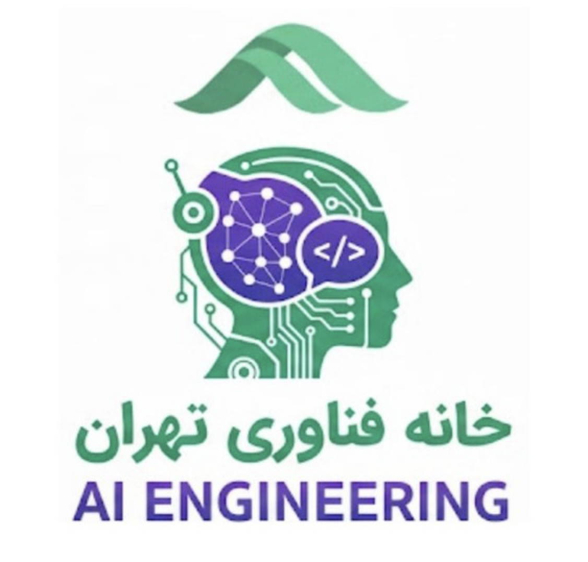

# AI Engineering Tutorial

> A comprehensive lecture series covering the full stack of AI engineering—from Python fundamentals to production systems.

**Instructor:** Ali Pilehvar Meibody  
**Organization:** [Fanavari Co.](https://fanavari.co)  
**License:** MIT

<p align="center">
  
</p>

---

## Overview

This repository contains lecture materials and implementations for a professional AI Engineering course. The curriculum extends beyond traditional machine learning to encompass the entire engineering foundation: numerical computing, data science, visualization, ML/DL pipelines, AI agents, databases, and DevOps tooling (Linux, CLI, Git).

---

## Curriculum Structure

| Module | Topic | Description | File |
|--------|-------|-------------|------|
| **01** | Python Review | Variables, types, control flow, functions, classes, iterables | [AI_Python_Review.py](AI_Tutorials/AI_Python_Review.py) |
| **02** | Advanced OOP | Object-oriented design, `@property`, `@staticmethod`, `@classmethod`, encapsulation | [ADVANCED_Class_Object.py](AI_Tutorials/ADVANCED_Class_Object.py) |
| **03** | CLI & Shell | Bash, navigation, file management, text editors (vim/nano), networking tools | [AI_CLI.md](AI_Tutorials/AI_CLI.md) |
| **04** | Git & Version Control | Local versioning, staging, commits, GitHub, project supervision | [AI_GIT.md](AI_Tutorials/AI_GIT.md) |
| **05** | Telegram Bots | Bot setup, handlers (command, message, callback), inline keyboards, conversation flow | [telegram_tutorial/](telegram_tutorial/README.md) |
| **06** | NumPy | Arrays, indexing, slicing, broadcasting, linear algebra, numerical computation | [AI_NUMPY.py](AI_Tutorials/AI_NUMPY.py) |
| **07** | Matplotlib | Visualization and graphics with matplotlib | [AI_Matplotlib.ipynb](AI_Tutorials/AI_Matplotlib.ipynb) |
| **08** | Linear Algebra | Vectors, matrices, transformations, eigenvalues, and core algebra for AI | [AI_Linear_Algebra.py](AI_Tutorials/AI_Linear_Algebra.py) |
| **09** | Calculus | Derivatives, gradients, optimization intuition, and calculus essentials for ML | [AI_Calculus.py](AI_Tutorials/AI_Calculus.py) |
| **10** | Numerical Methods | Numerical stability, approximation, and computational techniques | [AI_Numerical.py](AI_Tutorials/AI_Numerical.py) |
| **11** |  Pandas | Library for data analysis and work with data | [AI_Pandas.py](AI_Tutorials/AI_Pandas.py) |
| **12** | Data Cleaning | Data Cleaning before Machine learning (With Pandas) | [AI_Pre_Processing.py](AI_Tutorials/AI_Pre_Processing.py) |
| **13** | Statistics | Statistics Overview required for Machine learning | [AI_Statistics.py](AI_Tutorials/AI_Statistics.py) |
| **14** | Linear Regression | Introduction of Machine learning and linear regression| [AI_Regression.ipynb](AI_Tutorials/AI_Regression.ipynb) |
| **15** | Machine Learning Intro | Introduction of Machine learning | [AI_Ml_intro.ipynb](AI_Tutorials/AI_Ml_intro.ipynb) |
| **16** | Machine Learning Models | Machine learning models| [ML_Models.ipynb](AI_Tutorials/ML_Models.ipynb) |
| **17** | GridSearchCV| Hyperparameter tuning with cross validation| [AI_ML_GridsearchCV.ipynb](AI_Tutorials/AI_ML_GridsearchCV.ipynb) |
| **18** | Feature Engineering | Preparing data before ML Pipelines| [AI_Feature_engineering.ipynb](AI_Tutorials/AI_Feature_engineering.ipynb) |
| **19** | Machine Learning Pipeline | Complete Pipeline for preprocessing and Modeling| [AI_ML_Pipeline_.ipynb](AI_Tutorials/AI_ML_Pipeline_.ipynb) |
| **20** | Unsupervised Machine Learning| Intro on Clustering and Dimentional reduction| [AI_ML_Unsupervised.ipynb](AI_Tutorials/AI_ML_Unsupervised.ipynb) |
| **21** | Machine Learning Examples| Real Example of Supervised regression, classification and unsupervised| [AI_ML_Examples.py](AI_Tutorials/AI_ML_Examples.py) |
| **22** | Introduction on Neural Networks| Neural Network concept and introduction on deep learning| [AI_Neural_Nets_Intro.ipynb](AI_Tutorials/AI_Neural_Nets_Intro.ipynb) |
| **23** | Deep learning introduction| Training neural network with tensorflow and pytorch| [AI_Deep_Learning.ipynb](AI_Tutorials/AI_Deep_Learning.ipynb) |
| **24** | Deep learning In details| Activatuion, loss , optimizer concepts in neural networks| [AI_Deep_Learning_in_details.ipynb](AI_Tutorials/AI_Deep_Learning_in_details.ipynb) |
| **25** | Deep learning Coding | More notes on pytorch and tensorflow and classification example| [AI_Deep_learning_coding.ipynb](AI_Tutorials/AI_Deep_learning_coding.ipynb) |
| **26** | Convolutaional neural networks (CNNs) | Other archietctures of neural networks for vision| [AI_CNNs.ipynb](AAI_Tutorials/AI_CNNs.ipynb) |
| **27** | Recurrent neural networks(RNN)| Intro on RNN and recurrent feedback loops | [AI_RNN.ipynb](AI_Tutorials/AI_RNN.ipynb) |
| **28** |Intro on Natural Language processing (NLP) | intro on NLP and tokenization and embedding models| [AI_NLP.ipynb](AI_Tutorials/AI_NLP.ipynb) |
| **29** |Long-Short Term Memory (LSTM)| RNN limitation and emergence of LSTM  | [AI_LSTM.ipynb](AI_Tutorials/AI_LSTM.ipynb) |
| **30** |Auto encoders| Intro on Encoder-decoder for latent represnetation| [AI_Autoencoder.ipynb](AI_Tutorials/AI_Autoencoder.ipynb) |
| **31** |Deep Generative Models| intro on Variational autoencoder (VAE) and Generative Adversial network (GAN)| [AI_Generative_Model.ipynb](AI_Tutorials/AI_Generative_Model.ipynb) |
| **32** | Tutorials on Deep learning examples | Review on Deep learning architecture before examples   | [AI_DL_Example_Tutorials.ipynb](AI_Tutorials/AI_DL_Example_Tutorials.ipynb) |
| **33** |Deep learning example notes |  Notes on how the deep learning examples must be studied  | [AI_DL_Example_Notes.ipynb](AI_Tutorials/AI_DL_Example_Notes.ipynb) |
| **34** | Autoencoder Example |  Training Autoencoder on MNIST dataset with pytorch  | [Autoencoder_example.py](AI_Tutorials/Autoencoder_example.py) |
| **35** |  Variational Autoencoder example 1| Training VAE on MNIST dataset with Pytorch  | [VAE_example.py](AI_Tutorials/VAE_example.py) |
| **36** | Variational Autoencoder example 2 | Training VAE on CelebA faces datasets withPytorch    | [VAE_example2.py](AI_Tutorials/VAE_example2.py) |
| **37** |Generative Adversial network (GAN) |  Intro on Generative Adversial network (GAN) and toward diffusion models | [AI_DL_GAN.ipynb](AI_Tutorials/AI_DL_GAN.ipynb) |
| **38** | RNN on sentiment analysis  | Training RNN, LSTM , GRU on iMDB dataset for sentiment analysis  with pytorch | [RNN_examples.py](AI_Tutorials/RNN_examples.py) |
| **39** | LSTM on bitcoin prediction | Training  LSTM on bitcoin 60 days to predict next 7 days on gecoin dataset with pytorch   | [LSTM_EXAMPLE1.py](AI_Tutorials/LSTM_EXAMPLE1.py) |
| **40** | LSTM on Khayyam Poems | Training LSTM on Khayyam poems on ganjoor scraped data with pytorch| [LSTM_EXAMPLE2.py](AI_Tutorials/LSTM_EXAMPLE2.py) |
| **41** | LSTM Autocomplete python codes | Training LSTM on python codes for building python auto completion with pytorch| [LSTM_EXAMPLE3.py](AI_Tutorials/LSTM_EXAMPLE3.py) |
| **42** | LSTM on speech recognition | Training LSTM on Speech recognition commands with pytorch | [LSTM_EXAMPLE4.py](AI_Tutorials/LSTM_EXAMPLE4.py) |
| **43** | Overview of Deep learning| Review on deep learning architectures | [AI_DL_Overview.ipynb](AI_Tutorials/AI_DL_Overview.ipynb) |
| **44** | Sequence 2 Sequence Models | Intro on Sequence 2 sequence models | [AI_Seq2Seq.ipynb](AI_Tutorials/AI_Seq2Seq.ipynb) |
| **45** | Attention is all you need | Intro on Attention and Self-attention | [AI_Attention_is_all_you_need.ipynb](AI_Tutorials/AI_Attention_is_all_you_need.ipynb) |
| **46** | Transformers | Tutorials on Transformers| [AI_DL_Transformers.ipynb](AI_Tutorials/AI_DL_Transformers.ipynb) |
| **47** | Hugging Face | Friendly Intro on hugging face | [AI_DL_Intro_Hugging_Face.ipynb](AI_Tutorials/AI_DL_Intro_Hugging_Face.ipynb) |


---

## Reviews

| Review | Topic | File |
|--------|-------|------|
| **R01** | Python Review | [AI_Python_Review.py](AI_Tutorials/AI_Python_Review.py) |
| **R02** | 24 bahman | [Reviews/01_24bahman.py](Reviews/01_24bahman.py) |
| **R03** | 7 esfand | [Reviews/02_7Esfand_1404.md](Reviews/02_7Esfand_1404.md)|
| **R04** | 29 Khordad | [Reviews/03_29khordad.py](Reviews/03_29khordad.py)|

## Quiz

Tamame tamrin ha dakhele `Quiz/` folder hastand k bayad dar **repo** e k sakhtid ersal beshan

| Quiz | Focus | Suggested Prerequisite | File |
|------|-------|------------------------|------|
| **Q1** | Advanced Python, class methods, and errors | Modules 01-02 | [Q1.md](Quiz/Q1.md) |
| **Q2** | CLI and Git workflow practice | Modules 03-04 | [Q2.md](Quiz/Q2.md) |
| **Q3** | NumPy exercises | Module 06 | [Q3.md](Quiz/Q3.md) |
| **Q4** | Matplotlib exercises | Module 07 | [Q4.md](Quiz/Q4.md) |
| **Q5** | Pandas exercises | Module 08 | [Q5.md](Quiz/Q5.md) |
| **Q6** | Linear Regression | Module 13 | [Q6.md](Quiz/Q7.md) |
| **Q7** | ML Training | Module 16 | [Q7.md](Quiz/Q6.md) |
| **Q8** | Gridsearch and Pipeline | Module 19 | [Q8.md](Quiz/Q8.md) |


---

## Repository Structure

```
AIEngineeringToturial/
├── README.md
├── LICENSE
│
├── pictures/
│   └── apm_pic.png
│
├── telegram_tutorial/        # 05: Telegram bots (python-telegram-bot)
│   ├── README.md
│   ├── telegram_server.py
│   └── telegram_test1.py … telegram_test7.py
│
├── AI_Tutorials/
│   ├── README.md                    # Study guide and reading sequence
│   ├── AI_Python_Review.py          # Python fundamentals review
│   ├── ADVANCED_Class_Object.py     # dvanced classes and OOP
│   ├── AI_CLI.md                    # Command Line Interface & Shell
│   ├── AI_GIT.md                    # Git, GitHub, version control
│   ├── AI_NUMPY.py                  # NumPy tutorials for calculations
│   ├── AI_Matplotlib.ipynb          # Matplotlib for plotting
│   ├── AI_LINUX.md                  # Linux & DevOps
│   ├── AI_Linear_Algebra.py         # Linear Algebra with scipy and sympy
│   ├── AI_Calculus.py               # calculus with scipy and sympy
│   ├── AI_Numerical.py              # Numerical modeling 
│   ├── AI_Pandas.py                 # Pandas for DataFrames
│   ├── AI_Pre_Processing.py         # Pandas for data preprocessing
│   ├── AI_Statistics.py             # Statistics pre-Machine learning
│   ├── AI_Regression.ipynb          # Simple statistic Linear regression
│   ├── AI_Ml_intro.ipynb            # Introductin on Machine learning
│   ├── AI_ML_GridsearchCV.ipynb     # Gridsearch Cross Validation
│   ├── AI_Feature_engineering.ipynb # Feature engineering for ML
│   ├── AI_ML_Pipeline_.ipynb        # Pipeline for all Machine learning
│   ├── AI_ML_Unsupervised.ipynb     # Unsupervised learning
│   ├── AI_ML_Examples.py            # Practical Machine learning Examples
│   ├── AI_Neural_Nets_Intro.ipynb   # Introduction on Neural networks 
│   ├── AI_Deep_Learning.ipynb       # Introduction on Deep Learnings
│   ├── AI_Deep_Learning_in_details.ipynb  # More details  on Deep Learning
│   ├── AI_Deep_learning_coding.ipynb # Intro on coding with pytorch and tensorflow keras
│   ├── AI_CNNs.ipynb                # Introduction on Convolutional Neural Networks (CNNs)
│   ├── AI_RNN.ipynb                 # Recurrent Neural Networks
│   ├── AI_NLP.ipynb                 # Introduction on Natural Language processing
│   ├── AI_LSTM.ipynb                # Introduction on LSTM
│   ├── AI_Autoencoder.ipynb         # Introduction on Encoder-Decoder models
│   ├── AI_Generative_Model.ipynb    # Introduction on Generative models (VAE ,GAN)
│   ├── AI_DL_Example_Tutorials.ipynb # Tutorials on DL Examples
│   ├── AI_DL_Example_Notes.ipynb    # Notes on how study examples
│   ├── Autoencoder_example.py       # Example on MNIST Autoencoder training
│   ├── VAE_example.py               # Example on MNIST VAE Training
│   ├── VAE_example2.py              # Example on CelebA VAE Training
│   ├── AI_DL_GAN.ipynb              # Introduction on Generative adversial network (GAN)
│   ├── RNN_examples.py.             # Example on IMDB Sentiment analysis with RNN
│   ├── LSTM_EXAMPLE1.py             # Example on Bitcoin prediction with LSTM
│   ├── LSTM_EXAMPLE2.py             # Example on Khayyam Poem Generator with LSTM
│   ├── LSTM_EXAMPLE3.py             # Example on Python autocomplete with LSTM
│   └── LSTM_EXAMPLE4.py             # Example on Speech recognition with LSTM
│
├── Reviews/                  # Review / summary files
│   ├── 01_24bahman.py
│   ├── 02_7Esfand_1404.md
│   └── 03_29khordad.py
│
│
├── Utils/                  # Utils / Helper files
│   └── exampl_import.py
│
└── Quiz/                     # Practice assignments
    ├── README.md
    ├── Q1.md
    ├── Q2.md
    ├── Q3.md
    ├── Q4.md
    ├── Q5.md
    ├── Q6.md
    ├── Q7.md
    ├── Q8.md
    └── quiz_data
        ├── Material_Strength_Temperature.xlsx
        ├── taxi_fare_dataset.xlsx
        ├── delivery_time_dataset.csv
        └── home_energy_consumption_dataset.xlsx


```

---

## Getting Started

1. **Clone the repository**
   ```bash
   git clone https://github.com/APMaii/AIEngineeringToturial.git
   cd AIEngineeringToturial
   ```

2. **Set up environment** (recommended: Conda or venv)
   ```bash
   conda create -n ai_eng python=3.10
   conda activate ai_eng
   pip install numpy pandas matplotlib scikit-learn
   ```

3. **Follow the modules** in order: Python Review → Advanced OOP → CLI → Git → NumPy → Pandas → Matplotlib → ML → DL → Agents & Databases → Linux.

---

## Learning Path

```
Python Review → Advanced OOP → CLI → Git
        ↓
NumPy → Pandas → Matplotlib
        ↓
Machine Learning → Deep Learning
        ↓
Agents & Databases → Linux & DevOps
```

---

## Collaboration

For questions, exercises, or collaboration:

- **Email1:** [alipilehvar1999@gmail.com](alipilehvar1999@gmail.com)
- **Email2:** [ali.pilehvarmeibody@studenti.polito.it](ali.pilehvarmeibody@studenti.polito.it)
- **Email3:** [ali.pilehvarmeibody@epfl.ch](ali.pilehvarmeibody@epfl.ch)

- **Repository:** Open issues or pull requests for contributions.

---

## References

- [Python Built-in Functions](https://docs.python.org/3/library/functions.html)
- [NumPy Documentation](https://numpy.org/doc/)
- [Pandas Documentation](https://pandas.pydata.org/docs/)
- [Matplotlib Documentation](https://matplotlib.org/stable/contents.html)
- [Git Documentation](https://git-scm.com/doc)

---

*© 2026 Ali Pilehvar Meibody · Fanavari Co. · MIT License*
